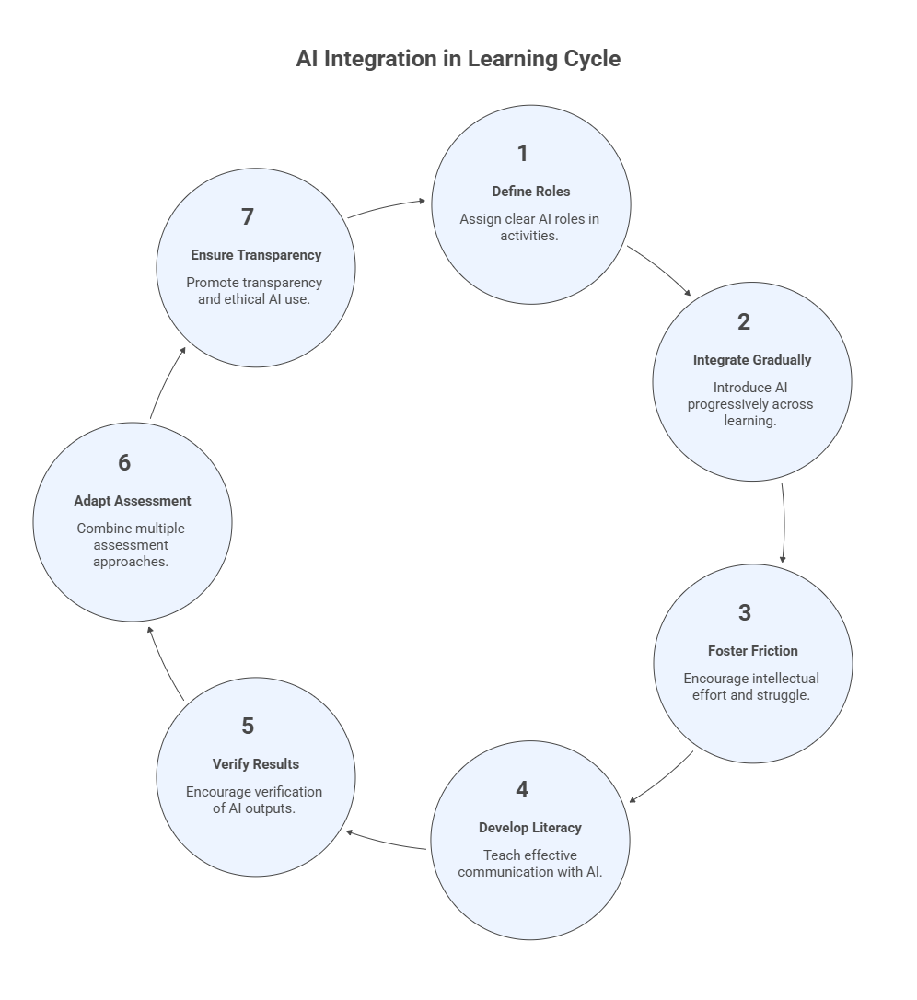

# 0. Pedagogical Foundations for Teaching with AI

Artificial Intelligence is rapidly transforming how knowledge is created, accessed, and applied. In education, this transformation requires more than simply adopting new tools, it requires rethinking
how learning is designed, guided, and assessed.

This module introduces the **pedagogical foundations for Teaching with AI**, providing the conceptual grounding for the rest of the course. While later modules focus on the **operational workflow of teaching with
AI**, this module establishes the principles that guide **AI‑augmented learning**.

The central idea is that effective Teaching with AI rests on two complementary pillars:

-   **Pedagogical Integration**, aligning AI use with learning outcomes, instructional design, and assessment.
-   **Instrumental Augmentation**, using AI tools to enhance planning, teaching, feedback, and reflection.

Module 0 focuses on the **first pillar: Pedagogical Integration**. It presents the key principles that ensure AI strengthens learning rather than replace it.

## Learning Objectives

After completing this module, participants will be able to:

-   Explain why AI requires new pedagogical approaches in higher education.
-   Define the concept of **AI‑Augmented Learning**.
-   Understand the **seven pedagogical principles** that guide the integration of AI in teaching.
-   Recognize how these principles connect to the instructional workflow presented in the following modules.

## 0.1 Why AI Changes Learning

Generative AI systems can now perform tasks that traditionally required significant cognitive effort, including:

-   summarizing complex material
-   generating explanations
-   producing code
-   drafting essays
-   analyzing data

Because these systems can perform tasks associated with **knowledge production**, they change the learning environment in fundamental ways.

In traditional education, instructors could assume that most intellectual work performed by students reflected their own reasoning. 
With AI systems available, this assumption no longer holds.

As a result, educators must redesign learning experiences to ensure that students:

-   develop conceptual understanding
-   practice reasoning and judgment
-   learn how to work responsibly with intelligent systems

Teaching with AI therefore requires **intentional pedagogical design**, not simply tool adoption.

### Example: Literature Course

Students traditionally write essays analyzing literary themes. With AI available, students could easily generate an essay draft in seconds. Instead of banning AI, the instructor redesigns the activity:
1.  Students analyze a passage and write an initial interpretation **without AI**.
2.  Students ask an AI system for an alternative interpretation.
3.  Students compare the two analyses.
4.  Students write a reflection explaining which interpretation is stronger and why, and how they could be merged into an even better essay.

Learning now focuses on **critical reasoning rather than text generation**.

### Exercise 1: Rethinking a Learning Activity

Choose a learning activity you currently use in your course.
1.  Describe the activity.
2.  Identify how students might use AI to complete the task.
3.  Redesign the activity so that AI supports **thinking rather than replacing it**.

Write a short paragraph describing your redesigned activity.

## 0.2 AI‑Augmented Learning

The concept of **AI‑Augmented Learning** refers to educational experiences in which:
-   students interact with AI tools
-   instructors design activities that incorporate AI
-   learning remains centered on human reasoning and understanding

In AI‑augmented learning environments:
-   AI can support exploration and explanation
-   AI can accelerate routine tasks
-   AI can help students test ideas

However, **students remain responsible for understanding, evaluating, and refining the outputs produced by AI systems**.

The goal is not to replace thinking with AI, but to help students learn **how to think in an AI‑enabled world**.

### Example: Data Analysis Course

Students are asked to analyze a dataset. Instead of manually writing code from scratch, students may ask AI to generate initial code or even perform the whole analysis for them.

However, the assignment requires students to:
-   explain the analysis method
-   validate the results
-   interpret the findings
-   critique the AI‑generated code

The focus shifts from **code generation to analytical reasoning**.

### Exercise 2: AI as a Thinking Partner

Ask an AI system the following prompt:
```
Explain the concept of feedback loops in learning.
```

Then:
1.  Evaluate the explanation.
2.  Identify at least **two strengths**.
3.  Identify **two possible weaknesses or limitations**.
4.  Write an improved explanation.

## 0.3 The Seven Pedagogical Principles

Teaching with AI is guided by seven pedagogical principles that help instructors design meaningful and responsible learning experiences.

These principles are not rigid rules; instead, they serve as **design guidelines** for integrating AI into teaching.



### Principle 1: Intentional Role Definition

AI should be assigned a **clear role** within learning activities. Possible roles include:
-   tutor
-   brainstorming partner
-   coding assistant
-   writing assistant
-   simulation engine

Students should understand:
-   what AI is allowed to do
-   what the student must do independently
-   how AI outputs should be used

Clear role definition helps prevent confusion about authorship, responsibility, and learning expectations.

**Example**

In a design course, AI acts as a brainstorming partner while students
produce the final design and justify their decisions.

**Exercise 3**

Complete the statement:

> In this activity, AI will function as a \_\_\_\_\_\_\_\_\_\_ while
> students remain responsible for \_\_\_\_\_\_\_\_\_\_.

### Principle 2: Progressive Integration

AI should be introduced **gradually across the learning process**. A common progression may include:
- **Foundation Stage** Students learn core concepts and skills with limited or no AI assistance.
- **Applied Stage** Students begin using AI tools to support problem solving and exploration.
- **Extended Stage** Students learn to critically evaluate and refine AI‑generated outputs.

This progression ensures that AI **supports skill development rather than replacing it**.

**Example**

Statistics course:
**Foundation**: students compute regression manually.\
**Applied**: students use AI to generate regression code.\
**Extended**: students evaluate whether the AI method was appropriate.

**Exercise 4**

| Stage | Student Activity | AI Role |
|------|------------------|--------|
| **Foundation** |  |  |
| **Applied** |  |  |
| **Extended** |  |  |               

### Principle 3: Productive Friction

Learning often requires **intellectual effort and struggle**. If AI removes all difficulty from a task, students may lose opportunities to develop understanding.

Productive friction means designing activities where students must: 
-   analyze AI responses
-   detect errors
-   refine prompts
-   justify decisions

In this way, AI becomes a **thinking partner rather than an answer generator**.

**Example**

Students analyze an AI-generated solution containing a deliberate error and must identify and correct it.

**Exercise 5**

Prompt an AI system to solve a problem in your field and identify at least **one possible flaw** in the response.

### Principle 4: Prompt Literacy

Students must learn how to communicate effectively with AI systems. Prompt literacy includes:
-   formulating clear instructions
-   refining prompts iteratively
-   interpreting AI responses
-   recognizing limitations of AI models

Prompt literacy is becoming an important **digital reasoning skill** for the AI era.

**Exercise 6**

Iteratively improve a prompt three times and compare the responses.

### Principle 5: Verification‑First Learning

AI systems can produce convincing but incorrect outputs. 

Students must learn to **verify AI results** using:
-   evidence
-   reasoning
-   external sources
-   domain knowledge

Verification‑first learning encourages students to treat AI outputs as **hypotheses rather than final answers**.

**Exercise 7**

Ask AI a question in your field and verify the answer using **two independent sources**.

### Principle 6: Hybrid Assessment

Assessment strategies must adapt to AI‑enabled environments.

Hybrid assessment combines multiple approaches, such as:
-   AI‑assisted assignments
-   AI‑restricted activities
-   in‑class demonstrations of reasoning
-   iterative project development
-   reflective explanations of work

This approach allows instructors to evaluate both **process and understanding**, not only final products.

**Exercise 8**

Design a hybrid assessment strategy for one assignment in your course. 

> **Note**: This will be explored further in Module 4 about assignment design.

### Principle 7: Transparency, Ethics, and Accountability

Students should be transparent about their use of AI. Courses should clearly communicate:
-   when AI use is allowed
-   when it is restricted
-   how AI contributions should be acknowledged

Ethical AI use also includes:
-   respecting academic integrity
-   protecting data privacy
-   recognizing limitations and biases in AI systems

Responsible AI use is an essential component of **professional practice in the AI era**.

**Exercise 9**

Write a short **AI usage statement** policy for your course.

> **Note**: This will be explored further in Module 2 about pedagogical planning.

## 0.4 Connecting Principles to the Teaching Workflow

The pedagogical principles introduced in this module guide the instructional practices explored in the rest of the course.

The following modules examine how AI can support different stages of the teaching process:

| Module | Focus |
|------|------|
| Module 1 | Instrumental Augmentation Process |
| Module 2 | Pedagogical Planning |
| Module 3 | Class Design |
| Module 4 | Assignment Design |
| Module 5 | Class Delivery |
| Module 6 | Student Support |
| Module 7 | Assessment and Feedback |
| Module 8 | Reflection and Continuous Improvement |

In each stage of the workflow, instructors apply the principles introduced in this module to ensure that AI use **enhances learning while maintaining academic rigor and responsibility**.

### Reflection Activity

Reflect on the following questions:
1.  Which of the seven principles do you already apply?
2.  Which will require the most adjustment?
3.  How might AI change how students demonstrate understanding in your
    field?

Write a short reflection summarizing your answers.

## 0.5 Key Takeaways

-   Teaching with AI requires both **pedagogical integration** and **instrumental augmentation**.
-   AI‑augmented learning places human reasoning at the center of the educational experience.
-   The **seven pedagogical principles** help instructors design meaningful AI‑supported learning activities.
-   These principles guide the practical teaching strategies explored in the rest of the course.
